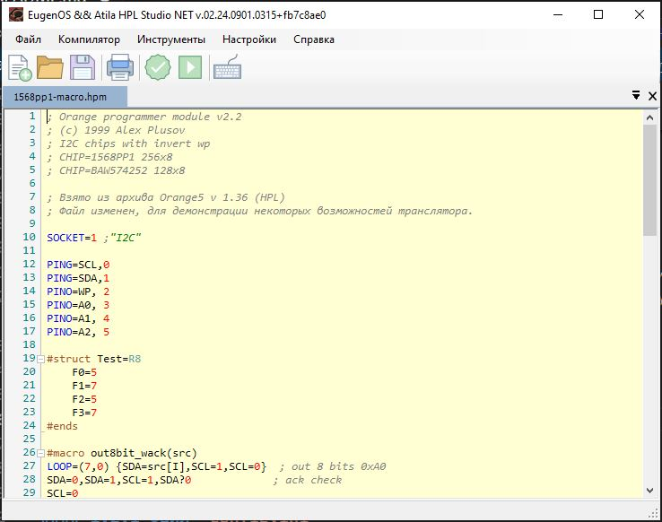

# HPL-Studio-NET

Редактор для скриптов программаторов Omega/Orange
Поддерживает дополнительные макроопределения, подключение файлов, битовые структуры и т.п.

[1. Описание программы](#1-описание-программы)  
[1.1 Интерфейс программы](#11-интерфейс-программы)  
[1.2 Настройки программы](#12-настройки-программы)  
[1.2.1 Файл `config.ini`](#121-файл-configini)
[2. Расширения макроязыка HPM](#2-расширения-макроязыка-hpm)
[2.1 include](#21-include)
[2.2 def](#22-def)
[2.3 macro ... endm](#23-macro--endm)
[2.4 struct ... ends](#24-struct--ends)
[3. Описание языка программаторов семейства Omega/Orange](#3-описание-языка-программаторов-семейства-omegaorange)  
[3.1. Ограничения языка HPL](#31-ограничения-языка-hpl)

## 1. Описание программы

  Когда-то потребовалось написать достаточно сложный скрипт для Omega LA, для нализа пакетов передаваемых через ИК. Очень быстро 
понял, что начинаю путаться в том какие регистры для чего и где используются и какие биты в них флагами чего являются.
Тогда родилась идея сделать что-то вроде препроцессора, который бы позволил раздать имена (по сути упрощенный аналог #define в С)
За вечер был реализован препроцессор запускаемый из коммандной строки, причем в процессе написания (как препроцессора, так и скрипта)
возникли идеи расширения его функционала, что в конечном итоге помогло и скрипт был написан. Под новый год, опять же за вечер, 
по настроению, была написана на C++Builder несложная оболочка с подсветкой синтаксиса и еще какими-то маленькими плюшками.
Так появился проект HPL-Studio.
  Позже, уже в середине 10-х, в рамках объяснения одному товарищу "что такое программирование, и с чем его едят", было решено обновить проект.
Тем более C++Builder 6 морально устарел, а более свжие версии как-то не снискали популярности (и имхо, вполне заслужено). Было решено реализовать все на C#, с .NET-Framework. Добавить туда нормальные макросы, предопределенные константы, имена для регистров, используемых как
идентификаторы чего-либо, и т.п. например:

```hpm
$SIZE=RF            ;  полный размер памяти (из cfg)
$OPERATION=RE       ;  глобальный код операции, и константы к нему:
$OPERATION.READ=1
$OPERATION.VERIFY=2
$OPERATION.WRITE=3
$OPERATION.USER=4
```

  Так же расширенную поддержку для структур с битовыми полями. Как-то: (скрытые) макросы геттеров и сеттеров, пересчет индексов битов с учетом 
смещения поля и многое другое. Таким образом, работа с битами становится более наглядной и удобной.

```hpm
#struct Test=R8
  F0=5
  F1=7
  F2=5
  F3=7
#ends

[test_func]
  ; присвоение значения всему регистру
  Test = 0x123456
  ; присвоение значения полю F0
  Test.F0=01
  ; присвоение значения (только нужное количество бит, в данном случае 5) из регистра
  Test.F2=R5
  ; получение значения поля в регистр
  R4=Test.F2
  ; присвоение одного поля другому
  Test.F1=Test.F3
  ; работа с битами полей
  Test.F2[0] = 1
  Test.F2[1] = 0
  Test.F2[2] = Test.F3[0]
  Test.F2[4]?1{R5[0]=Test.F3[5], R6=Test.F3[6]}

```

  В планах так же были (и в принципе остаются, была бы необходимость) готовые шаблоны для разных интерфейсоы программатора, как-то
UART, CAN, MTRK (там физически несколько интерфейсов, но с документацией и примерами не очень. Если разработчики позволят, то почему не добавить), а так же софтовые решения типа I2C, SPI, MW и т.п.  По факту являющиеся, в основном макросами, но не отобажающимися в коде,
а встроенными в язык.

### 1.1 Интерфейс программы



|Кнопка    |  Пункт меню  | Функция  |
|----------|--------------|----------|
||Файл->Создать|Создает новый файл скрипта |
||Файл->Открыть|Открывает существующий файл|
||Файл->Сохранить|Сохраняет файл на диске|
||Файл->Сохранить как|Сохраняет файл на диске под другим именем|
|||Печать на принтер|
||Компилятор->Собрать|Транслирует HPM скрипт в HPL скрипт|
||Компилятор->Передать в|Транслирует HPM скрипт в HPL скрипт, сохраняет его в папке инструмента (например Orange5) и вызывает программу этого инструмента |
||Инструменты|В меню инструментов список заданных пользователем (в `config.ini`)программ, которым может быть передан полученный HPL скрипт|
||Настройки->Горячие клавишы|Натройка горячих клавиш программы|
||Настройки->Инструменты программатора|Открывает файл `config.ini`|
||Настройки->Добавлять все значения|Чек-бокс. Включает добавление в комментарии всех скрытых и виртуальных макросов|
||Настройки->Добавлять все макросы|Чек-бокс. Включает добавление в комментарии всех defin'ов сгенерированных при компиляции|
||Настройки->Кодировка|Устанавливает кодировку по умолчанию для открываемых и создаваемых файлов|
||Справка->Помощь по программе|Показывает этот документ|
||Справка->Помощь по|Справка активного выбранного инструмента|
||Справка->О программе|Показывает окно `О программе`|
||Справка->Справка в сети|Показывает самую актуальную версию этого документа, напрямую с github|

### 1.2 Настройки программы

#### 1.2.1 Файл `config.ini`

Файл состоит из секций.

- Секция `[default]` создается программой. Ее не желательно трогать руками.  
- Секция `[selected]` создается программой. Ее не желательно трогать руками.  
- Остальные секции описывают запускаемые инструменты комплекта Omega/Orange и имеют следующий вид:

  ```ini
   [Orange5]
   path=%ProgramFiles%\O5\orange5.v1.36
   exe=orange.exe
   help=help_ru.chm
   xml=""
  ```

  - `path` - путь к паке содержащей инструмент (в данном примере Orange5)
  - `exe` - имя исполняемого файла (может содержать относительный путь, по отношению к `path`)
  - `help` - файл справки. (может содержать относительный путь, по отношению к `path`).  
    Так же может содержать ссылку на интернет страницу, в этом случае
  путь является абсолютным и должен начинаться с `http://` или `https://`  
  Поддерживаются: `.chm`, `.md`, `.html`,  планируется `.pdf`, ...
  - `xml` - дополнительный xml для пользовательской настройки подсветки, подстановки и т.п. (см. следующий пункт справки про файл `hpm.xml`)

    *(`xml` Пока не проверялось, и нет примеров использования. Будет добавлено в будущем. Идея в том, что каждый инструмент имеет свои отличия в языке HPL. И предлагать и подсвечивать неподдерживаемые фичи, как бы не очень корректно)*

  *Прим. Все пункты содержащие пути, поддерживают подстановку системных переменных, как в примере с `path`*  

#### 1.2.2 Файл `hpm.xml`

Содержит настройки подсветки синтаксиса и автоподстановки языка HPL и расширения HPM
С форматом файла можно ознакомится на [сайте проекта FastColoredTextBox](https://www.codeproject.com/Articles/161871/Fast-Colored-TextBox-for-syntax-highlighting-2)

## 2. Расширения макроязыка HPM

## 2.1 include

Вставляет вместо данной строки содержимое указанного файла.

```hpm
#include=path_to/file_name.ext
```

Имейте ввиду, что необходимо соблюдать общую структуру конечного HPL файла

## 2.2 def

Однострочная макроподстановка, без параметров

```hpm
#def statusReg=R12


statusReg=DAT, statusReg=&0x17
```

## 2.3 macro ... endm

многострочная макроподстановка, с возможностью передачи параметров

```hpm
#macro start
SDA=1,SCL=1,SDA=0,SCL=0 ;start
#endm

#macro out8bit_w_ack(src)
LOOP=(7,0) {SDA=src[I],SCL=1,SCL=0}  ; out 8 bits 0xA0
SDA=0,SDA=1,SCL=1,SDA?0              ; ack check
SCL=0
#endm

[READ]
start
R0=0x0A, R1=0xA1
out8bit_w_ack(R0),SDA=0
out8bit_w_ack(ADR),SDA=0

start
out8bit_w_ack(R1),SDA=1
LOOP=(7,0){SCL=1,DATA[I]=SDA,SCL=0}  ;read byte
SDA=1,SCL=1,SCL=0,SDA=0              ;master not asked
stop
```

## 2.4 struct ... ends

Структуры с битовыми полями

```hpm
R10=FCMEN,L,Off,On                         ; Fail-Safe Clock Monitor Enable bit
R11=IESO,L,Off,On                          ; Internal External Switchover bit
R12=CLKOUTEN,L,On,Off                      ; Clock Out Enable bit
R13=BOREN,L,Off,SBOREN,BUTSLLEP,On         ; Brown-out Reset Enable bits(1)
R14=PROTECT,L,ALL,_DATA,CODE,NONE          ; CPD and CP
R15=MCLRE,L,DIGINPUT,MCLR                  ; MCLR/VPP Pin Function Select bit
R16=PWRTE,L,On,Off                         ; Power-up Timer Enable bit(1)
R17=WDTE,L,Off,SWDTEN,BUTSLLEP,On          ; Watchdog Timer Enable bit
R18=FOSC,L,LP,XT,HS,RC,INTOSC,ECL,ECM,ECH  ; Oscillator Selection bits


#struct config1=R8
   FOSC=3
   WDTE=2
   PWRTE
   MCLRE
   PROTECT=2
   BOREN=2
   CLKOUTEN
   IESO
   FCMEN
#ends


[_FUSE2BIT]

FOSC=config1.FOSC
WDTE=config1.WDTE
PWRTE=config1.PWRTE
MCLRE=config1.MCLRE
PROTECT=config1.PROTECT
BOREN=config1.BOREN
CLKOUTEN=config1.CLKOUTEN
IESO=config1.IESO
FCMEN=config1.FCMEN
```

- В верхней части, мв имеем объявление регистров для интерфейса программатора.
В соответствии с синтаксисом языка HPL
- Далее объявляется структура битовых полей, с именем config1 хранящаяся в регистре R8. Где:
  - битвы 0..2 соответствуют полю FOSC
  - биты 3..4 полю WDTE
  - бит 5 полю PWRTE 
  и так далее.
- Функция `_FUSE2BIT` преобразует считанное из контроллера слово _CONFIG1 в значение регистров интерфейса программатора. После компиляции для нее
будет сгенерирован следующий код *(Вернее функционально идентичный, реализация может измениться при модификации поведения макроязыка)*:

```hpm
[_FUSE2BIT]

R18[0]=R8[0], R18[1]=R8[1], R18[2]=R8[2]
R17[0]=R8[3], R17[1]=R8[4]
R16[0]=R8[5]
R15[0]=R8[6]
R14[0]=R8[7], R14[1]=R8[8]
R13[0]= R8[9], R13[1]=R8[10]
R12[0]=R8[11]
R11[0]= R8[12]
R10[0]=R8[13]
```

Обратите внимание, что имена регистров интерфейса, так же поддерживаются макроязыком и производится их замена, при трансляции из HPM в HPL

Так же поддерживается присвоение одних полей другим и операции с ними.

 *Прим. Возможны ограничения налагаемые компиляторами HPL*  
 *А так же огранчения вызваные реализацией синтаксического сахара HPM, в частности:*  
  
- *использование `R0` как регистра структуры, крайне не желательно, так как он используется в геттерах и сеттерах полей.*
- *использование регистра `R1` в качестве регистра структуры, не желательно. Особено если используются конструкции с 
    регистром `R0` как получатель/источник пр и работе с полями структур. В этих случаях `R1` используется как  временный
    регистр. Например в этих случаях, регистр `R1` будет изменен:*

    ```hpm
        R0 = CONFIG.FOSC
        ...
        CONFIG.PROTECT = R0
    ```

- *так же следует учитывать что регистры `R0`, `R1`, `R2` ... могут быть использованы как аргументы функций*

  Пример:

  ```hpm
  #struct Test=R8
      F0=5
      F1=7
      F2=5
      F3=7
  #ends


  [TEST]
  Test = 0x123456
  ; setter для константы, поле со смещением 0
  Test.F0=01
  ; setter для константы, поле со смещением не 0
  Test.F3=03
  ; setter для любого регистра, кроме R0
  Test.F2=R5
  ; setter для регистра R0
  Test.F1=R0

  ; getter для любого регистра, кроме R0
  R5=Test.F2
  ;  getter для регистра R0
  R0=Test.F2

  ; присвоение одного поля другому
  Test.F1=Test.F3

  ; работа с битами полей
  Test.F2[0] = 1
  Test.F2[1] = 0
  Test.F2[2] = Test.F3[0]
  Test.F2[4]?1{R5[0]=Test.F3[5], R6=Test.F3[6]}

  ```

  Результат:

  ```hpm
  ;#struct Test=R8
  ;    F0=5
  ;    F1=7
  ;    F2=5
  ;    F3=7
  ;#ends


  [TEST]
  R8 = 0x123456
  ; setter для константы
  R8=&0xFFFFFFFFFFFFFFE0, R0=01, R0=&0x1F, R8=|R0
  ; setter для любого регистра, кроме R0
  R8=&0xFFFFFFFFFFFE0FFF, R0=R5, R0=<<0xC, R0=&0x1F000, R8=|R0
  ; setter для регистра R0
  R1=R0, R8=&0xFFFFFFFFFFFFF01F, R0=<<0x5, R0=&0xFE0, R8=|R0, R0=R1

  ; getter для любого регистра, кроме R0
  R5=R8, R5=&0x1F000, R5=>>0xC
  ;  getter для регистра R0
  R0=R8, R0=&0x1F000, R0=>>0xC

  ; присвоение одного поля другому
  R0=R8, R0=&0xFE0000, R0=>>0x11, R8=&0xFFFFFFFFFFFFF01F, R0=<<0x5, R0=&0xFE0, R8=|R0

  ; работа с битами полей
  R8[12] = 1
  R8[13] = 0
  R8[14] = R8[17]
  R8[16]?1{R5[0]=R8[22], R6=R8[23]}
      
  ```

## 3. Описание языка программаторов семейства Omega/Orange

### 3.1. Ограничения языка HPL

*Прим. Пока проверялось на ПО программатора Orange5, для других инструментов ограничения могут отличаться, скорее всег не в большую сторону*
В результате тестирования, выявлены следующие ограничения компилятора HPL (конкретно Orange5)

- длинна имени секции (функции) 20 символов

  ```hpm
  [_T345678901234567890]
    PRINT=L("")
  ```

  если к имени добавить еще символ, софт программатора ругается

- кол-во аргументов PRINT <= 5

  ```hpm
  PRINT=L("RA:  0x%04X  RB:  0x%04X RC:  0x%04X RD :%04X RE: %04X RF: %04X\n", RA, RB, RC, RD, RE, RF)
  ```

- кол-во секций, ограничено (надо будет вычислить каким числом)
  фактически, столкнулся с этим когда делал геттеры и сеттеры полей структуры в виде функций. зато переделал геттеры/сеттеры на макросы
  
- с массивами возможны только следующие операции:  

  ```hpm
  Rx=@AR[I], 
  @AR[I]=Rx, 
  Rx=@AR[n], 
  @AR[n]=Rx
  ```
